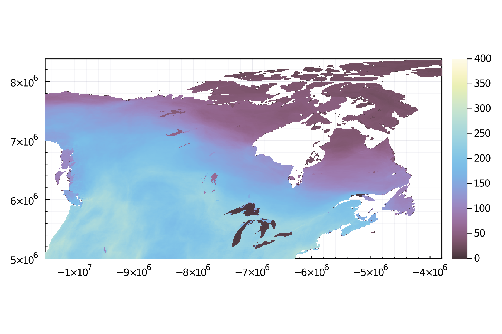
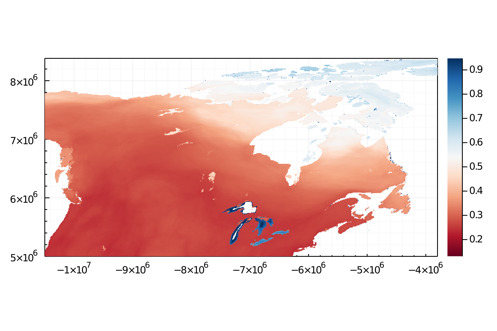

# Canadian Metaweb Working Group: first meeting

Predicting the structure of ecological networks can be useful to make better predictions of pairwise interactions. Here we predict the number of interactions between vertebrates in Canadian food webs and show how food-web stability depends on species richness.

We create 4 maps that will be presented to the first meeting of the Canadian Metaweb Working Group:

{#fig:L_median}

{#fig:L_median}

{#fig:L_PI}

{#fig:L_PI}
