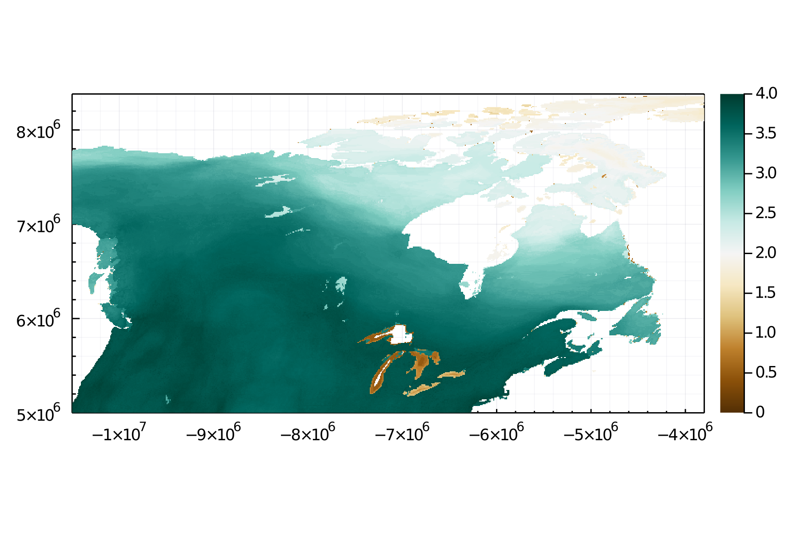

# Canadian Metaweb Working Group: first meeting

Predicting the structure of ecological networks can be useful to make better predictions of pairwise interactions. Here we predict the number of interactions between terrestrial vertebrate species in Canadian food webs and show how food-web stability depends on species richness.

We create 4 maps that will be presented to the first meeting of the Canadian Metaweb Working Group.

# Species richness
Number of terrestrial vertebrate species (mammals, birds, and amphibians) in Canada. Data taken from biodiversitymapping.org. Species richness is a very important measure, as it can be used to predict the number of links and the stability of food webs.

# Predicted number of links
Median predicted number of links between terrestrial vertebrate species in Canada (log scale). The flexible links model is used to predict the number of links from the number of species and all food webs archived on mangal.io are used for model fitting.

Percentile intervals (68%) of the predicted numbers of links (log scale).

# Stability scores
Stability scores of food webs of terrestrial vertebrate species in Canada. High numbers indicate a high probability that the corresponding networks are stable.

